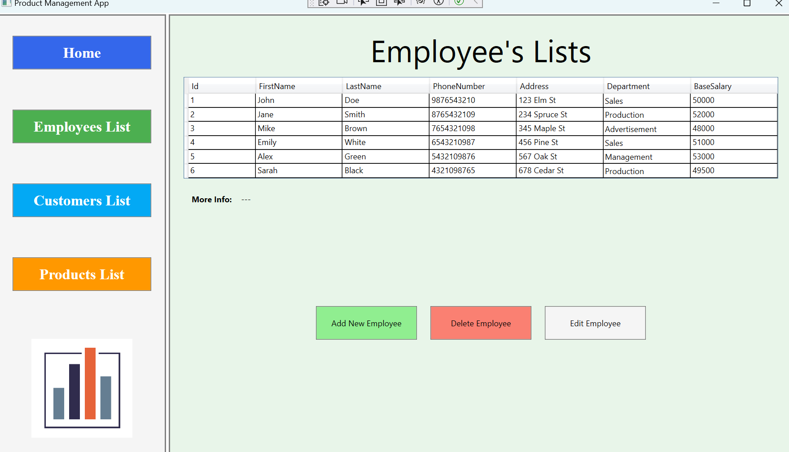
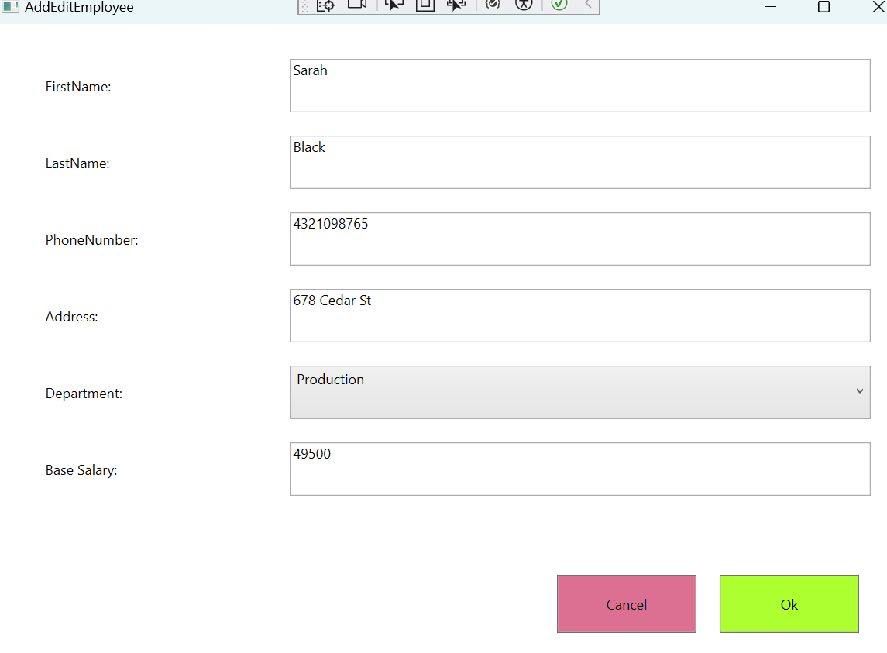

# Simple WPF Product Management App

## Overview
This simple Windows Presentation Foundation (WPF) application is designed to manage three key entities: Products, Customers, and Employees. 
It offers basic functionalities to add, remove, and edit entities within a lightweight CSV-based database system. 

## Features
- Manage Products: Add, edit, and remove product listings including details such as name, description, price, owner, and stock count.
- Manage Customers: Maintain customer information including name, contact details, and address.
- Manage Employees: Keep track of employee records, including personal details, department, and salary information.
## Interface

